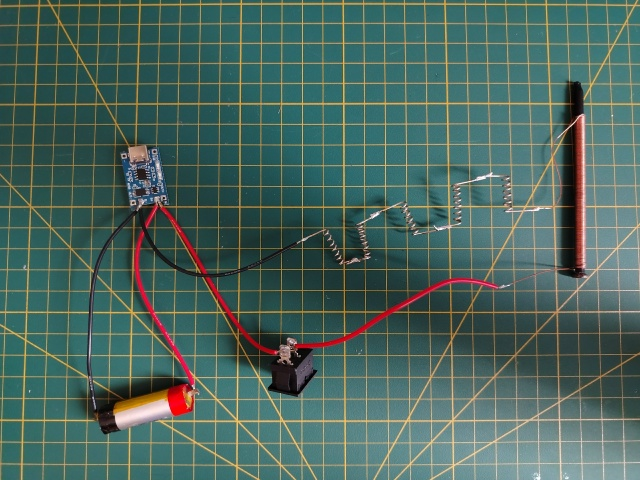

# ⚡ DIY Electro-magnet — Портативный электромагнит из гвоздя

Простой и мощный электромагнит, собранный из подручных материалов.  
Питается от литиевого аккумулятора 18650, заряжается через USB.  
Идеален для экспериментов, подъёма мелких металлических предметов и первого знакомства с электроникой.

---

## 📦 Что внутри

- Гвоздь 100–150 мм
- Медная проволока Ø0.5–0.8 мм (~2 метра)
- Аккумулятор 18650
- Зарядная плата TP4056 (с защитой)
- Выключатель
- 4 канцелярские скрепки (используются как резистор)

---
## 🔨 Как сделать катушку (гвоздь)

Это самый ответственный этап. Если сделать неправильно — магнит не будет работать.

### Шаг 1. Изолируй гвоздь термоусадкой

**Зачем:** Если намотать медную проволоку прямо на голый гвоздь — получится короткое замыкание. Ток пойдёт по гвоздю, а не по виткам.  
**Как сделать:**

1. Отрежь кусок термоусадки на **1–2 см длиннее гвоздя**.
2. Надень трубку на гвоздь (она должна быть чуть уже, чтобы сидеть плотно после усадки).
3. Нагрей феном или зажигалкой (держа гвоздь пассатижами, чтобы не обжечься).
4. Трубка плотно обтянет гвоздь — изоляция готова.

---

### Шаг 2. Оставь «хвосты» для подключения

- От начала провода оставь **10–15 см** свободного провода (это будет контакт).

---

### Шаг 3. Наматывай витки

- Наматывай проволоку **плотно, виток к витку**, без зазоров.
- Не допускай пересечений и наложений витков друг на друга.
- **Оптимальное количество:** 100–150 витков.
- Направление не важно (если только ты не делаешь второй слой — тогда мотай в ту же сторону).

---

### Шаг 4. Закрепи второй конец

- Когда дойдёшь до острия гвоздя, оставь **ещё 10–15 см** свободного провода.
- Зафиксируй последний виток скотчем или термоусадкой, чтобы намотка не раскрутилась.

---

### Шаг 5. Зачисти концы провода

- (Если) медная проволока покрыта лаком.
- Сними изоляцию с обоих концов с помощью **наждачной бумаги** или ножа.
- Зачищай до **блестящей меди** (розового цвета).

---

### Шаг 6. Проверь сопротивление

Возьми мультиметр, переключи в режим измерения сопротивления (200 Ом) и измерь между двумя концами провода.

| Что показывает | Что значит |
|----------------|------------|
| **1.5–2.5 Ома** | ✅ Отлично, всё правильно |
| **0–0.5 Ома** | ⚠️ Короткое замыкание (витки замкнуты через гвоздь) — перематывай заново |
| **1 (бесконечность)** | ⚠️ Обрыв провода — перематывай заново |

---

### ⚠️ Важные предупреждения

| Чего делать НЕЛЬЗЯ | Почему |
|-------------------|--------|
| Мотать на голый гвоздь | Будет КЗ, ток идёт по гвоздю, магнит не работает |
| Мотать в 2 слоя без изоляции между ними | Верхний слой может замкнуть нижний — потеря силы |
| Использовать провод тоньше 0.3 мм | Он перегорит от 1–2 Ампер |
| Держать включённым дольше 10 секунд | Провод перегреется, лак оплавится |

---

### 🔧 Совет для усиления

Если хочешь **максимальную силу в одной точке** — оставь **остриё гвоздя (1–2 см) свободным от намотки**. Вся сила магнита сосредоточится именно на конце.

---

## 🔌 Схема подключения

**Финальная рабочая схема:**

### Подключение:
- **Плюс аккумулятора** → **Выключатель** → **Гвоздь**
- **Минус гвоздя** → **4 скрепки (последовательно)** → **Минус аккумулятора**
- **Зарядная плата** подключена параллельно к аккумулятору (B+ / B-), отвечает только за зарядку.

---

## ⚙️ Параметры

| Параметр | Значение |
|----------|----------|
| Напряжение питания | 3.7–4.2 В (Li-ion) |
| Ток в цепи | ~1.05 А (с 4 скрепками) |
| Рекомендуемое время включения | до 10 секунд |
| Пауза между включениями | 20–30 секунд |

---

## 🚧 Проблемы, с которыми пришлось столкнуться

| Проблема | Решение |
|----------|---------|
| Зарядная плата уходит в защиту при подключении гвоздя | Подключил нагрузку напрямую к аккумулятору, минуя OUT+ / OUT- |
| Повышающий модуль сильно греется | Убрал его — он оказался бесполезен, т.к. литий сам даёт ~3.7–4.2 В |
| Гвоздь нагревается при долгой работе | Ограничил ток скрепками и использую импульсный режим (5–10 сек) |

---

## 🔮 Планы на будущее

- [ ] 3D-печатный корпус
- [ ] Замена скрепок на резистор 1 Ом 2 Вт
- [ ] Добавление ШИМ-регулятора для плавной регулировки силы

---

## 📄 Лицензия

Проект распространяется под лицензией MIT — пользуйтесь, дорабатывайте.
